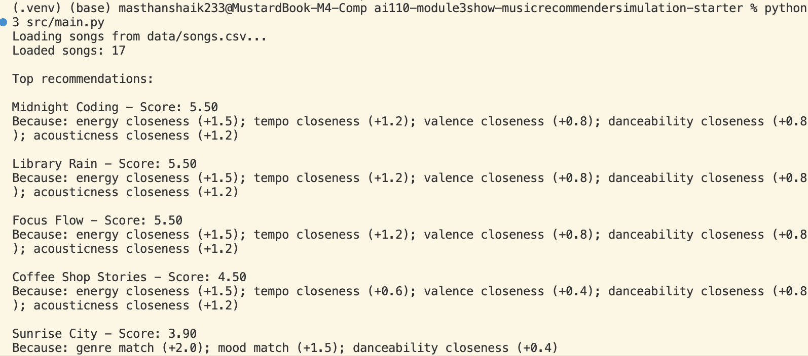

# 🎵 Music Recommender Simulation

## Project Summary

This project builds a rule-based music recommender that scores songs by comparing genre, mood, and several audio features to a user profile. It loads songs from a CSV file, calculates a weighted score for each track, and returns the top recommendations with explanations for why each song was chosen. The result is a system that shows how small changes in weights can change what gets recommended.

---

## How The System Works

Each song uses genre, mood, energy, tempo_bpm, valence, danceability, and acousticness. genre and mood are the strongest features so it goes down to the user's consistency when picking the important feature from the two (i.e. if the user is consistent with a certain genre then the genre plays a higher role). The UserProfile is where the preferred genre, mood, and values for the numeric features lie. The Recommender computes a score based off how close each song is to the user's preferences. As a result, the recommendation that comes out is a culimination of the higher scored song by the recommender along with one which hasn't been listned to, and gives some variety.

The final version of the algorithm scores every song against a single user taste profile, then recommends the ones with the highest scores. Each song earns points for matching things like genre and mood, plus extra points for being close to the user’s preferred values for features like energy, tempo, valence, danceability, and acousticness. This way, songs are rewarded for how closely they match the user’s ideal vibe—not just for having higher or lower values. The system can get too narrow and keep recommending the same type of songs, limiting discovery. In the current songs.csv, lofi mood and happy energy seem to show up slightly more.




---

## Getting Started

### Setup

1. Create a virtual environment (optional but recommended):

   ```bash
   python -m venv .venv
   source .venv/bin/activate      # Mac or Linux
   .venv\Scripts\activate         # Windows

2. Install dependencies

```bash
pip install -r requirements.txt
```

3. Run the app:

```bash
python -m src.main
```

### Running Tests

Run the starter tests with:

```bash
pytest
```

You can add more tests in `tests/test_recommender.py`.

---

## Experiments You Tried

I experimented with different user profiles to see how the scoring changed for pop, lofi, and more energetic listening styles. When I adjusted the weights, the recommendations shifted in predictable ways, which showed me that the scoring recipe has a strong effect on what the system considers a good match.

---

## Limitations and Risks

The recommender is limited by the small catalog, so it can only suggest from a narrow set of songs and may miss many other styles that a real listener would enjoy. It also does not understand lyrics, artist context, or deeper musical meaning, so it relies entirely on the tags and numeric features in the dataset. 

---

## Reflection

Read and complete `model_card.md`:

[**Model Card**](model_card.md)

I learned that recommenders work by turning data into scores and ranking items by total points. The system doesn’t “understand” music like a person; it just compares songs to the user profile and ranks them by how well they match the target vibe. This showed me how much the feature choices and weights shape the results—changing them changes the recommendations immediately.

I also learned that bias can show up very quickly when the catalog is small or when some genres and moods appear more often than others. If one style is overrepresented, the recommender can keep favoring it even when other songs might also be a good fit. This showed me that fairness in recommenders is not just about avoiding harmful data, but also about making sure the scoring rules do not accidentally narrow the user’s choices too much.

